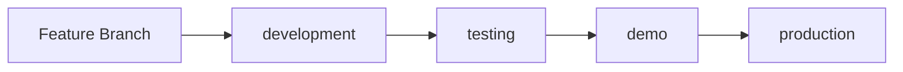

# Branch Strategy

## Overview

This repository uses a four-environment branch strategy with increasing levels of protection:

```
development → testing → demo → production
```

## Branches

### 🟢 development
- **Purpose**: Active development and integration
- **Protection**: Basic (1 approval)
- **Auto-deploy**: Yes, on push
- **Who can merge**: Any developer with 1 approval

### 🟡 testing
- **Purpose**: QA and integration testing
- **Protection**: Moderate (1 approval, dismiss stale reviews)
- **Auto-deploy**: Yes, on push
- **Who can merge**: Any developer with 1 approval

### 🟠 demo
- **Purpose**: Stakeholder demos and UAT
- **Protection**: Strict (2 approvals, code owner review)
- **Auto-deploy**: Yes, on push
- **Who can merge**: Senior engineers/leads with 2 approvals

### 🔴 production
- **Purpose**: Live production environment
- **Protection**: Maximum (2 approvals, code owner review, restricted merge)
- **Auto-deploy**: Yes, on push (after approvals)
- **Who can merge**: Only designated release managers

## Workflow



1. **Feature Development**
   ```bash
   git checkout development
   git pull origin development
   git checkout -b feature/my-feature
   # Make changes
   git push origin feature/my-feature
   # Create PR to development
   ```

2. **Promote to Testing**
   ```bash
   git checkout testing
   git merge development
   git push origin testing
   ```

3. **Promote to Demo**
   ```bash
   git checkout demo
   git merge testing
   git push origin demo
   ```

4. **Release to Production**
   ```bash
   git checkout production
   git merge demo
   git push origin production
   ```

## Branch Protection Rules

| Branch | Required Checks | Approvals | Dismiss Stale | Code Owner | Restrict Merge |
|--------|----------------|-----------|---------------|------------|----------------|
| development | CI/CD | 1 | No | No | No |
| testing | CI/CD | 1 | Yes | No | No |
| demo | CI/CD | 2 | Yes | Yes | No |
| production | CI/CD | 2 | Yes | Yes | Yes |

## Setting Up Branch Protection

### Option 1: Automated Setup (Recommended)
```bash
# Make the script executable
chmod +x scripts/setup-branch-protection.sh

# Run the setup script
./scripts/setup-branch-protection.sh
```

### Option 2: Manual Setup via GitHub UI

1. Go to Settings → Branches
2. Add rule for each branch with settings from table above
3. Required status checks:
   - `lint`
   - `test`
   - `security`
   - `sonarcloud`
4. Configure environments in Settings → Environments

## Environment-Specific Configuration

Each environment can have different:
- AWS accounts
- API endpoints
- Feature flags
- Resource sizing

Configure in:
- **GitHub Secrets**: Environment-specific secrets
- **CDK Context**: `cdk.json` with environment overrides
- **SSM Parameters**: `/sc0red/{environment}/config`

## Hotfix Process

For critical production fixes:

```bash
git checkout production
git checkout -b hotfix/critical-fix
# Make minimal fix
git push origin hotfix/critical-fix
# Create PR directly to production (requires 2 approvals)
# After merge, backport to other branches
git checkout demo
git cherry-pick <commit-hash>
git push origin demo
# Repeat for testing and development
```

## Rollback Process

If issues are detected after deployment:

```bash
# Find the last known good commit
git log production --oneline

# Revert to previous version
git checkout production
git revert HEAD
git push origin production

# Or reset to specific commit (requires force push permissions)
git reset --hard <good-commit>
git push --force origin production
```

## Notes

- Never force push to protected branches
- Always merge "upstream" (dev→test→demo→prod)
- Hotfixes should be rare and backported
- Each environment has isolated AWS resources
- CodeRabbit reviews all PRs automatically
